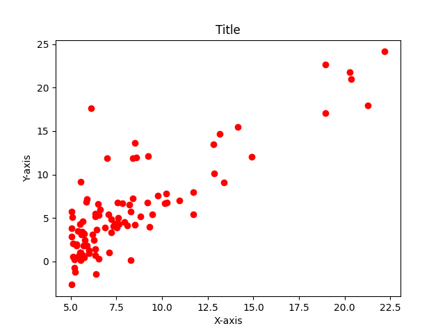
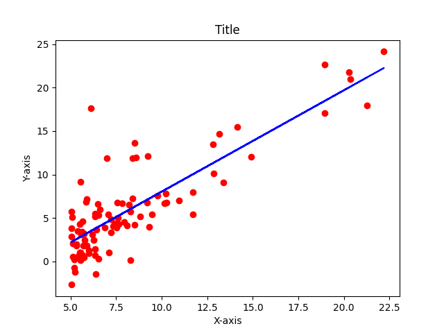
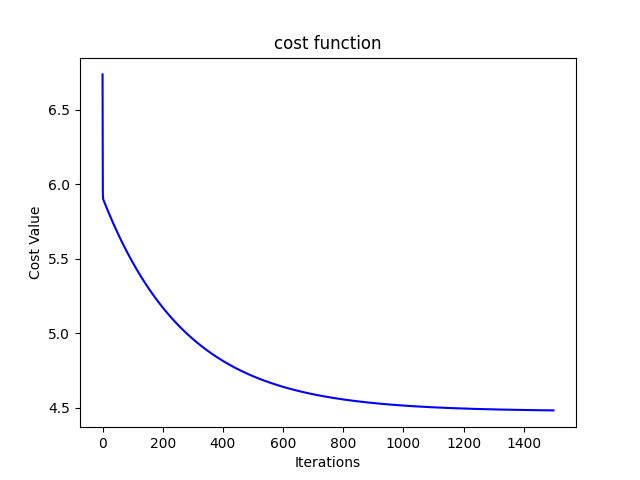

# Linear-Regression

The LinearRegreesion.py is the module that I wrote in python. It uses Numpy and matplotlib. Refer try_linear_regression.py to see how you can use it. 

To import the LinearRegression class Use:

     from LinearRegression import LinearRegression

Now create the instance of the class as:

     model = LinearRegression()
     
 Using this you can use all the methods of this class:
 
 1] Use model.fit(x, y, alpha, iteations, return_params):
      
 
      alpha--learning rate (default=0.01)
      
      iterations--iterations to train the model(default=1500)
      
      return_params--returns the trained parameters(default=False)...set return_params = True if you want the trained parameters
      
 2] Use model.predict(X):
     
 
 This method returns prediction for a give set of values of X
 
        X--the value of X for which you want to predict the values of y
               
              
 
 
 3] Use model.plotdata(X, y,title="Title", X_label="X-axis", y_label="Y-axis"):
   
   
   This method plots your dataset
 
      X--the x value of your data
      y--the y value of  your data
      title--the title of your plot (default=Title)
      X_label--the label of your X-axis(default=X-axis)
      y_label--The label of your Y-axis(default=Y-axis)
      
This is as example of how your plot might look like:

 
 
 4] Use model.plotregressor(X, y,title="Title", X_label="X-axis", y_label="Y-axis")
          
  
  
  This method plots your regressor model

    
 
      X--the x value of your data
      y--the y value of your data
      X_label--the label of your X-axis(default=X-axis)
      y_label--the label of your y-axis(default=y-axis)
      
This is an example of how your plot might look like:

 5] Use model.plotcost()
     
  
  This method plots cost function

 
 This is an example of how your plot might look like:
 
 
 
 
 
 
 # Note:
 1) You need to have [numpy](https://numpy.org/) installed
 2) You need to have [matplotlib](https://matplotlib.org/) installed
 3) This works only for the dataset where X has only one feature ---> i.e. this is simple linear regression. So if your dataset has more than one feature for X, then all the above methods will not work and will throw dimentionality error
 
